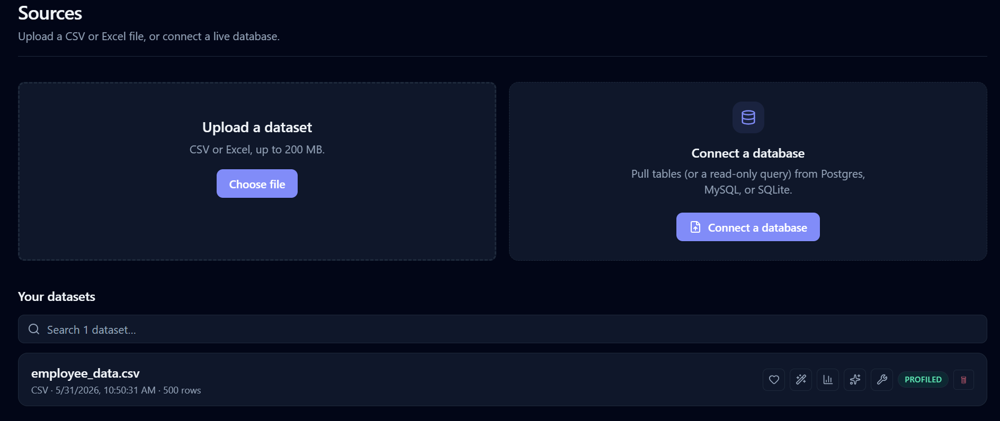
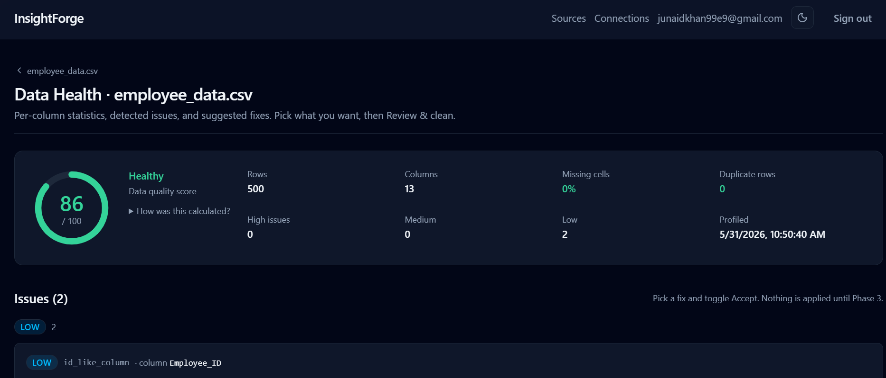
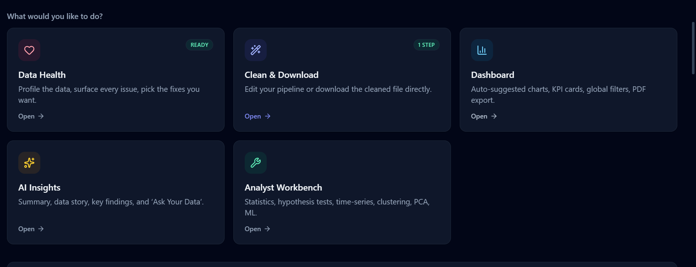

<div align="center">

# 🔮 InsightForge

### Upload messy data → clean it → understand it → export it.

**An AI-powered data analysis platform that takes a CSV or database table from raw to explained — without ever sending your raw data to an AI model.**

<br/>

[](./backend)
[](https://python.org)
[](https://nextjs.org)
[](https://typescriptlang.org)
[](https://fastapi.tiangolo.com)
[](./LICENSE)

<br/>


<br/>

</div>

---

## 🎯 The Problem It Solves

Most people staring at a spreadsheet don't need a data scientist — they need someone to **clean the mess, draw the right charts, and tell them what the numbers actually mean.**

InsightForge does exactly that. Drag in a CSV, click a button, walk away with cleaned data, a working dashboard, and a plain-English explanation of what's in it. Everything happens in clicks — no SQL, no Python, no notebooks.

The twist: the AI layer that explains your data **never sees your actual rows.** That's not a marketing line — it's enforced by a dedicated test suite.

---

## ✨ Preview

<div align="center">

<table>
<tr>
<td width="33%" align="center">

<br/><sub><b>📁 Dataset Home</b></sub>
<br/><sub>Six capabilities, one launchpad</sub>
</td>
<td width="33%" align="center">

<br/><sub><b>🩺 Data Health</b></sub>
<br/><sub>Auto-profiled with fix suggestions</sub>
</td>
<td width="33%" align="center">

<br/><sub><b>📊 Dashboard</b></sub>
<br/><sub>Auto-built charts, draggable grid</sub>
</td>
</tr>
</table>

</div>

---

## 🚀 Core Capabilities

<table>
<tr>
<td width="50%" valign="top">

### 🧹 Clean

- **Auto-profile** every column: types, nulls, duplicates, outliers (IQR + Z-score + Isolation Forest), data-quality score `/100`
- **Auto-Clean agent** proposes a complete fix pipeline with rationales — one click to a clean dataset
- **30+ manual operations**: mean / median / mode / KNN imputation, outlier capping, type conversion, text normalisation, datetime feature extraction, encoding, scaling, binning
- **Live dry-run preview** before applying any step
- Raw data is **immutable** — every clean creates a new auditable version
- Download as **CSV or Excel** — done, no dashboard required

</td>
<td width="50%" valign="top">

### 📊 Visualize

- **Auto-recommended charts** based on column types and cardinality
- **Dual chart engines** — Plotly for statistical plots, ECharts for heatmaps and large scatter (router picks per chart type)
- **Drag-resizable grid**, global filters that update every chart together, KPI cards
- **Editable** chart type, columns, palette, axes, legend
- **Save / load dashboards**, persisted per user
- **PNG export** per chart, full **PDF report** combining charts + AI narrative

</td>
</tr>
<tr>
<td width="50%" valign="top">

### 🤖 AI Insights

- Auto-generated **dataset summary** and narrative **data story**
- **3–5 key insights** with severity badges and clickable follow-up analyses
- **Ask Your Data** — plain-English questions → natural-language answers + result table + chart + the analysis spec that was actually executed
- All AI outputs **cached per cleaned version** to conserve free-tier quota
- Graceful handling of rate limits and missing keys

</td>
<td width="50%" valign="top">

### 🔬 Analyst Workbench

Nine tools, each with a plain-language interpretation:

`Descriptive stats` · `Correlation explorer` · `Hypothesis tests`
`Time-series decomposition` · `Clustering (auto-k)` · `PCA`
`Anomaly detection` · `Feature importance` · `Baseline ML`

→ Result tables, charts via the same router, downloadable predictions CSV

</td>
</tr>
<tr>
<td width="50%" valign="top">

### 🔌 Live Database Connections

Connect **Postgres**, **MySQL**, or **SQLite**. Browse the schema, import any table or read-only query as a new dataset. From there it flows through every other capability automatically.

</td>
<td width="50%" valign="top">

### 🎨 Polish

- **Light + dark mode** across every page, every component, and inside both chart libraries
- Polished design system (slate + indigo)
- **Skeleton loaders**, friendly empty states, microcopy that helps
- **Tooltips on jargon** so non-technical users aren't lost

</td>
</tr>
</table>

---

## 🔒 Privacy & Security — Enforced by Tests

> The AI layer **never** sees your raw data. The Ask-Your-Data flow can **never** execute model-generated code or SQL. These aren't promises — they're test assertions.

<table>
<tr><th align="left">Protection</th><th align="left">How it works</th></tr>
<tr><td><b>No raw rows to AI</b></td><td>Gemini receives only schema, semantic types, summary statistics, distributions, correlations, and the cleaning history. Tests assert no row data appears in the AI context.</td></tr>
<tr><td><b>Ask-Your-Data sandboxed</b></td><td>Gemini outputs a structured analysis spec from a <b>fixed allowlist</b>. Backend validates against real columns and executes with pandas. Model output is never run as code.</td></tr>
<tr><td><b>Injection precheck</b></td><td>Manipulation attempts are blocked before any Gemini call fires.</td></tr>
<tr><td><b>DB credentials encrypted</b></td><td>Fernet symmetric encryption. Key lives only in backend env vars.</td></tr>
<tr><td><b>Read-only DB connections</b></td><td>Enforced at the driver level — Postgres <code>default_transaction_read_only</code>, MySQL <code>SET SESSION TRANSACTION READ ONLY</code>, SQLite <code>mode=ro</code>.</td></tr>
<tr><td><b>SQL validation</b></td><td>Only <code>SELECT</code> / <code>WITH</code> allowed. Every destructive keyword rejected.</td></tr>
<tr><td><b>SSRF blocked</b></td><td>Private / loopback / link-local IPs refused by default. Override available for local dev only.</td></tr>
<tr><td><b>Row-Level Security</b></td><td>Supabase RLS scopes every row and storage path to the authenticated user.</td></tr>
<tr><td><b>JWKS authentication</b></td><td>JWT verification via Supabase's asymmetric signing keys, with legacy HS256 fallback.</td></tr>
</table>

---

## 🏗️ Architecture

```
┌─────────────────────────┐         ┌──────────────────────────┐         ┌─────────────────┐
│                         │         │                          │         │                 │
│  Next.js 15 + React 19  │ ◄─────► │  FastAPI + Python 3.12   │ ◄─────► │   Supabase      │
│  TypeScript strict      │  HTTPS  │  pandas · scipy          │  HTTPS  │   PostgreSQL    │
│  Tailwind v4            │         │  scikit-learn            │         │   Auth (JWKS)   │
│  Plotly + ECharts       │         │  statsmodels             │         │   Storage (RLS) │
│                         │         │                          │         │                 │
└─────────────────────────┘         └────────────┬─────────────┘         └─────────────────┘
                                                 │
                                                 │ schema + stats only
                                                 │ (never raw rows)
                                                 ▼
                                      ┌──────────────────────┐
                                      │   Google Gemini      │
                                      │   gemini-2.5-flash   │
                                      └──────────────────────┘
```

**Three processes, three clear contracts.** FastAPI is the only process that touches Gemini — the API key is backend-only. The frontend talks to Supabase for auth, FastAPI for everything else. Every dashboard chart is **server-aggregated** — the frontend never receives a whole dataset.

### Design decisions worth defending

**Why Python on the backend?** Every serious data feature (statistical tests, time-series decomposition, clustering, PCA, anomaly detection, baseline ML) lives in Python's data ecosystem. JavaScript would have meant rebuilding mature libraries from scratch.

**Why two chart libraries?** Plotly excels at statistical and distribution plots; ECharts excels at heatmaps and large-data scatter with canvas perf. A single source-of-truth `CHART_ENGINE` map decides which engine per chart type. The frontend's `<Chart>` router reads the `engine` field stamped by the backend and dispatches accordingly. The two libraries never need to know about each other.

**Why server-side aggregation?** The backend groups, bins, samples, and correlates — sending only chart-ready payloads of a few KB. Large scatter plots are sampled with sampling status surfaced in the UI. Ten charts on a dashboard equals ten small responses, not ten dataset downloads.

---

## 🛠️ Tech Stack

<table>
<tr><th align="left">Layer</th><th align="left">Stack</th></tr>
<tr><td><b>Frontend</b></td><td>Next.js 15 (App Router), React 19, TypeScript (strict), Tailwind CSS v4, next-themes, lucide-react, sonner</td></tr>
<tr><td><b>Charts</b></td><td>Plotly.js, Apache ECharts, react-grid-layout</td></tr>
<tr><td><b>Backend</b></td><td>Python 3.12, FastAPI, Pydantic v2, Gunicorn + uvicorn workers</td></tr>
<tr><td><b>Data / ML</b></td><td>pandas, numpy, scipy, statsmodels, scikit-learn</td></tr>
<tr><td><b>AI</b></td><td>Google Gemini <code>gemini-2.5-flash</code>, <code>google-genai</code> SDK</td></tr>
<tr><td><b>Auth / Storage</b></td><td>Supabase (PostgreSQL, JWKS auth, private storage bucket)</td></tr>
<tr><td><b>DB connectors</b></td><td>SQLAlchemy + psycopg2 + pymysql; SQLite via stdlib</td></tr>
<tr><td><b>Crypto</b></td><td><code>cryptography</code> (Fernet for DB credentials)</td></tr>
<tr><td><b>Export</b></td><td>jsPDF (client-side reports), openpyxl (Excel)</td></tr>
<tr><td><b>Testing</b></td><td>pytest — 202/202 passing; TypeScript typecheck clean</td></tr>
<tr><td><b>Package managers</b></td><td>pip (backend), pnpm (frontend)</td></tr>
</table>

---

## ⚡ Quick Start

### Prerequisites

- Python **3.12+**
- Node **20+** and **pnpm**
- A free [Supabase](https://supabase.com) project
- A free [Gemini API key](https://aistudio.google.com)

### 1️⃣ Clone & install

```bash
git clone https://github.com/junaidniazi1/InsightForge.git
cd InsightForge

# Backend
cd backend
python -m venv .venv
.venv\Scripts\activate              # Windows
# source .venv/bin/activate         # macOS / Linux
pip install -r requirements.txt

# Frontend
cd ../frontend
pnpm install
```

### 2️⃣ Set up Supabase

1. Create a new project → save the database password.
2. In SQL Editor: run `supabase/migrations/0001_init.sql` then `0002_ai_cache.sql`.
3. Confirm in Table Editor that all tables exist and the `datasets` storage bucket is created.

### 3️⃣ Configure environment

**`backend/.env`**

```env
SUPABASE_URL=https://<project-ref>.supabase.co
SUPABASE_SERVICE_ROLE_KEY=<service role key>
SUPABASE_JWT_SECRET=<JWT secret — legacy fallback>

GEMINI_API_KEY=<your key>
GEMINI_MODEL=gemini-2.5-flash

# Generate with: python -c "from cryptography.fernet import Fernet; print(Fernet.generate_key().decode())"
DB_ENCRYPTION_KEY=<generated key>

CORS_ALLOWED_ORIGINS=http://localhost:3000
DEV_ALLOW_PRIVATE_DB_HOSTS=false
```

**`frontend/.env.local`**

```env
NEXT_PUBLIC_SUPABASE_URL=https://<project-ref>.supabase.co
NEXT_PUBLIC_SUPABASE_ANON_KEY=<anon key>
NEXT_PUBLIC_API_URL=http://localhost:8000
```

### 4️⃣ Run

```bash
# Terminal 1 — backend
cd backend && uvicorn app.main:app --reload --port 8000

# Terminal 2 — frontend
cd frontend && pnpm dev
```

Open **[http://localhost:3000](http://localhost:3000)** → sign up → upload a CSV → done.

---

## 📖 How to Use

After uploading or importing a dataset, six capabilities are available from the dataset home page:

| Step | Capability | What you do |
|:----:|:-----------|:-------------|
| 1️⃣ | **Data Health** | Review the auto-profile. Each detected issue (nulls, type mismatches, outliers) has a suggested fix — toggle which ones to accept. |
| 2️⃣ | **Clean & Download** | Click **✨ Auto-Clean** for a full proposed pipeline, or hand-build from the 30+ operation toolbox. Live preview every step. Apply → download cleaned CSV or Excel. |
| 3️⃣ | **Dashboard** | Add auto-recommended charts to a draggable grid. Edit type, columns, palette, axes. Save the dashboard; export PNGs or a full PDF report. |
| 4️⃣ | **AI Insights** | Read the auto-generated summary and data story. Browse 3–5 key insights. Ask plain-English questions and see the answer + result table + chart. |
| 5️⃣ | **Workbench** | Run any of 9 analyst tools. Each returns numbers, a chart, and a plain-language interpretation. Push results to the dashboard or report. |
| 6️⃣ | **Connections** | Save a Postgres / MySQL / SQLite connection. Browse its schema. Import a table or a read-only query as a new dataset. |

**A typical end-to-end flow** takes about 3 minutes: upload a messy CSV → Auto-Clean → glance at the Data Story → export the PDF. Or skip everything after step 2 and walk away with just a clean spreadsheet.

---

## 🧪 Testing

```bash
# Backend — 202/202 passing
cd backend && pytest -q

# Frontend
cd frontend && pnpm typecheck && pnpm build
```

**What the suite covers:**

- Data immutability — cleaning never mutates raw versions
- AI privacy contract — no raw rows ever reach the AI context
- Ask-Your-Data — injection rejection, allowlist enforcement, made-up-column rejection
- DB credential encryption — round-trip + tamper rejection
- SSRF guard — every private IP range blocked
- SQL validator — every destructive keyword rejected
- JWKS auth — RS256 verification + HS256 legacy fallback
- Per-tool correctness — every workbench analysis on crafted datasets with known mathematical answers

---

## 📂 Project Structure

```
InsightForge/
├── backend/
│   ├── app/
│   │   ├── main.py                  # FastAPI app, CORS, router mounts
│   │   ├── config.py                # Pydantic settings
│   │   ├── deps.py                  # Auth dependency
│   │   ├── services/
│   │   │   ├── profiler.py          # Data profiling
│   │   │   ├── cleaner.py           # 30+ preprocessing operations
│   │   │   ├── auto_clean.py        # Auto-pipeline agent
│   │   │   ├── chart_engine.py      # Plotly/ECharts router   ⭐
│   │   │   ├── ai_context.py        # Privacy filter          ⭐
│   │   │   ├── ask_data.py          # Plan→validate→execute   ⭐
│   │   │   ├── db_connectors.py     # External DB connections
│   │   │   ├── crypto.py            # Fernet encryption
│   │   │   └── workbench/           # 9 analyst tools         ⭐
│   │   ├── routers/                 # FastAPI endpoints
│   │   ├── schemas/                 # Pydantic models
│   │   └── tests/                   # 202 backend tests
│   └── requirements.txt
├── frontend/
│   └── src/
│       ├── app/                     # Next.js App Router pages
│       └── components/
│           ├── charts/              # Chart router + wrappers
│           ├── clean/               # Pipeline editor, toolbox
│           ├── dashboard/           # Builder, filters, export
│           ├── ai/                  # Summary, story, ask box
│           ├── workbench/           # 9 tool tabs
│           └── connections/         # DB connection UI
└── supabase/migrations/
    ├── 0001_init.sql                # Schema + RLS + storage bucket
    └── 0002_ai_cache.sql            # AI output cache
```

> ⭐ **For reviewers** — the most engineering-interesting files are `ask_data.py` (plan-validate-execute-explain), `ai_context.py` (privacy filter), `cleaner.py` (operation registry), `chart_engine.py` (single-source chart router), and `workbench/` (data-science toolkit).

---

## 🗺️ Status

<div align="center">

| Phase | Scope | Status |
|:----- |:----- |:----- |
| 1 | Foundation — auth, upload, preview | ✅ |
| 2 | Data Health engine | ✅ |
| 3 | Preprocessing engine — 30+ ops | ✅ |
| 4 | Auto-dashboard with chart router | ✅ |
| 5 | AI layer with privacy contract | ✅ |
| 6 | Standalone export · auto-clean · editing · PDF | ✅ |
| 7 | Analyst Workbench — 9 tools | ✅ |
| 8 | Live DB connectors + JWKS auth | ✅ |
| 9 | Production deployment | 🚧 |

</div>

**Possible future expansions:** an autonomous Insight Agent (runs workbench tools end-to-end, returns ranked findings), natural-language dashboard builder, time-series forecasting (Prophet / ARIMA), multi-dataset joins, bundled sample datasets.

---

## 📜 License

MIT — see [LICENSE](./LICENSE).

---

<div align="center">

**Built with care by [Junaid Niazi](https://github.com/junaidniazi1)**

*Inspired by the gap between "I have data" and "I understand my data" — and the realisation that AI can help bridge that gap without seeing the raw data itself.*

<br/>

⭐ **If you find this useful, a star on the repo means a lot.**

</div>
